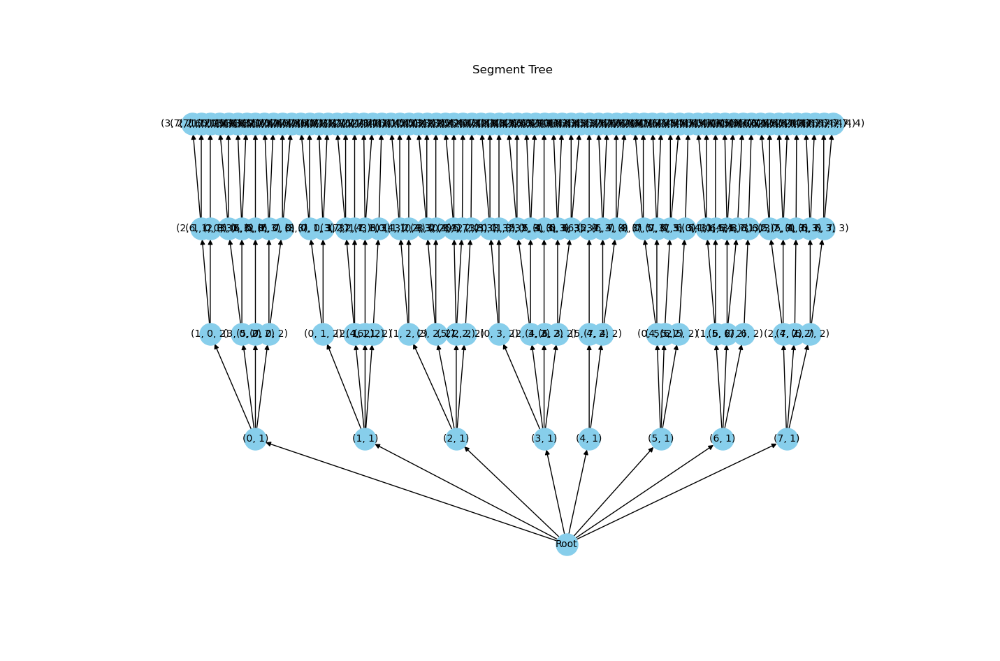

# April Tags: Quad Detection in Images

For this project, we decided to delve into the algorithm that allows computers to detect April Tags in images. As this is a large and complicated algorithm, we decided to focus on two steps: segmentation and quadrilateral (quad) detection.

## Background

April Tags are specially-designed black-and-white squares that are made to be easily converted into position and orientation information.

*Example April Tag*

The overarching steps are as follows:

1. Calculate the gradient of the image
2. Group together pixels which have a similar gradient
3. Convert those groups of pixels to line segments
4. Find candidate quadrilaterals from that image
5. Compute the linear transformation from the quadrilateral to the camera
6. Scan the quadrilateral for the light and dark regions to determine if it is a known April Tag, and which Tag it was if so

In this project, we worked our way through steps 1-4 of the April Tag detection process, using the algorithm described [Olson's original April Tag Paper](https://april.eecs.umich.edu/media/pdfs/olson2011tags.pdf) as a point of reference.

Throughout our documentation, visualizations are performed on this test image of a black rectangle within a white rectangle:

## Implementation

###  Pixel Clustering and Segmentation

We started by converting the input image into black-and-white. From here, we used 2-D convolution to approximate the gradient of the image, using the Scharr Operator (convolving a special 3-by-3 matrix and its transpose with the image to calculate the X and Y gradient). From here, we calculated the magnitude and direction of the image gradient.

Once we had the gradient, we grouped pixels which had similar gradients. To do this, we created a graph of the image, where each pixel shares an edge with each of its adjacent neighbors. This edge is assigned a weight equal to the difference in gradient direction between them. We also assigned each pixel to its own "cluster". We then sorted the edges from the least weight to most weight. In order of increasing weight, we take the two clusters the two pixels of that edge belong to, and consider combining them (if they are already in the same cluster, we skip the edge and continue). We combine the two clusters if:

1. The range of gradient directions in the resulting cluster is less than or equal to the range of directions in cluster A or cluster B (whichever is smaller), plus some constant divided by the number of pixels in the resulting cluster. Formally, for clusters $m$ and $n$, we combine them if and only if: $D(n \cup m) \le \text{min}(D(n), D(m)) + \frac{K_D}{|n \cup m|}$, where $D(c)$ gives the range of gradient directions in cluster $c$
2. The range of gradient magnitudes in the resulting cluster is less than or equal to the range of magnitudes in cluster A or cluster B (whichever is smaller), plus some constant divided by the number of pixels in the resulting cluster. Formally, for clusters $m$ and $n$, we combine them if and only if: $M(n \cup m) \le \text{min}(M(n), M(m)) + \frac{K_M}{|n \cup m|}$, where $M(c)$ gives the range of gradient magnitudes in cluster $c$

As recommended by the paper, we used values of 100 and 1200 for $K_D$ and $K_M$, respectively, though they claim that a wide range of values should work.

Repeating this for every edge will result in groups of pixels which follow straight line edges (or are in patches of very consistent color). 

*Merged pixel clusters found in the test image where each color represents a different cluster. Two large clusters for the black area within the rectangle and the white area outside of it are hidden for clarity.*

To convert these groups into lines, we run Principal Component Analysis on the set of points to compute a unit vector pointing in the direction of the best fit line. From here, we project each of the points onto that vector, and find the ones that project furthest in either direction. These projected points are defined as the end points of the line segment for that cluster. Finally, we sort the two points so that travelling along the line from the first point to the second point will keep the darker side on the right to help with quad detection.

*Lines fit to pixel clusters shown above with direction such that the dark area of the image is on the right of the line. The two horizontal segments in the middle are line segments formed from the large clusters of solid color.*

###  Quad Detection

After all possible segments are detected, it's time to find all of the potential and valid quadrilaterals (or quads). All four vectors must be close enough to one another and have the same winding order. To find these segments, the algorithm takes a recursive depth-first search approach.

#### Segmentation Tree
To optimize searching through all combinations of segments, the algorithm constructs a tree with a depth of four. At depth one, all segments are added to the tree as a node. From the next three layers, any segment that hasn't already been picked by its parent nodes and obeys the winding rule and a close enough threshold is added on.

*Example Segment Tree with Eight Segments*

#### Distance Threshold and Lookup Table
The distance between segments is calculated from the end coordinates of the first segment to the starting coordinates of the second segment. According to [Olson's original April Tag Paper](https://april.eecs.umich.edu/media/pdfs/olson2011tags.pdf), an appropriate threshold for segment distance is determined as twice the length of the first segment plus an additional five pixels. While this threshold may result in a relatively high false positive rate, later steps in the algorithm revisit these quads to narrow down the list. The paper emphasizes the importance of maintaining a high false positive rate to ensure that all real April tags are included within the quads.

The segmentation tree building algorithm references the distance between segments and checks if it's under the threshold a large number of times. To optimize the algorithm, the paper suggests performing these calculations only once by creating a lookup table. Our lookup table is of size [n x n], where 'n' represents the total number of segments. Each value in the table is either 'true' or 'false' and signifies whether the first segment is considered "close enough" to the second segment

*Threshold: 2 * length + 5*
*Because our test image was significantly cleaner (no lighting variation, extreme contrast) and smaller than an actual photo of an AprilTag would be, the suggested threshold resulted in a higher false positive rate than was useful for our application.*

*Threshold: 50 pixels*
*A smaller threshold for the distance between the end of one segment and the start of the next resulted in much more accurate quad detection for our test image.*

#### Winding Order Lookup Table
For a quad to be valid, all of its segments must follow a specific winding order. Each segment has a starting point and an end point, which means they all have a direction. Winding order checks that each segment goes in the same direction. Determining the winding direction involves taking the cross product of two segments. A positive value indicates a clockwise winding order, while a negative value indicates a counterclockwise order.

While the paper didn't specify the method used to check winding order when building the tree, we decided to reuse the lookup table technique employed for the distance threshold. This lookup table contained the sign of the cross product for each segment, represented as -1, 0, or 1. We converted the cross product into its sign to simplify the value checking in our tree-building function. The tree-building function checked if the current depth matched the winding order of the previous depth. Therefore, the lookup table would contain either 1 or -1 for each complete branch of the tree. Note that the value cannot be 0, as it would indicate that two connecting segments are parallel to each other.

#### Depth First Search
Once the tree was completed, a depth-first search recursively explored the tree to find any path containing exactly four segments/nodes. While most of the optimization and removal of invalid quads happens during tree construction, we still need to ensure that we avoid counting quads twice. The tree may contain quads with the same segments in different orders. To address this issue, we only allowed quads that start with the segment having the minimum index out of the other segments in the quad to be added to the list of quads.

## Design Decisions
### Winding order
One of the most significant decisions we made was considering the winding order of the line segments when detecting quads. In the paper we reference, the quads were detected using a counterclockwise winding order (i.e., the detected quads were of dark squares). Our options for the winding rule were counterclockwise (as done in the paper), clockwise, which would detect the light squares, or either counter- and clockwise. We decided this last option made the most intuitive sense, as it seemed critical to be able to detect both the light and dark squares of the April tag.

## Challenges
One of our earliest hurdles was interpreting the reference paper, which used very 
The most significant challenge we faced was testing our code, as we were addressing a very visual question. We alleviated this problem in a few ways: 1) Instead of testing our code on busy, detailed images, we made our own very simple images with  very few quads and variation. With these "ideal case" images, we knew exactly where to expect quads and line segments from our code. 2) Our line segments and quads were stored in matrices, and printing these was not an effective way to visualize whether our code was working. Instead, we created visualizations to plot them, and while it took a significant amount of extra effort, the troubleshooting power was invaluable.

## Possible Future Improvements

Given more time, our team would have implemented the final two steps of April Tag detection: pose estimation and decoding.

#### Pose Estimation
One common use case for April Tags is visual localization. With knowledge of the real-life dimensions and expected orientation of the April Tag, camera specs, and the cartesian coordinates of the corners of any given quadrilateral found with our program from an image taken by the camera, we could compute a homography transformation from the quadrilateral to the camera. This would be a linear transformation between the plane the quadrilateral is on to the plane the camera is on. This relationship could be used to to estimate the pose of the camera relative to the April Tag's position and orientation in the world.

#### Decoding
Olson's original paper describes building a model of the identified quadrilaterals, assigning each one to be white or black by sampling the outer border of the tag for what values count as white/black in different areas of the image to account for possible lighting variations. A coding system based on lexicodes is used to check if this constructed model matches a valid April Tag or not. This coding system rejects codewords that would create simple patterns likely to occur in the environment (like a single black and white stripe), and accounts for all four possible 90-degree rotations of any given tag by defining the minimum Hamming distance in each case. Lexicodes have been pre-generated for several libraries of April Tags. If a lexicode generated from the model of the identified April Tag candidate has a Hamming distance below a certain threshold (suggested 9 or 10) compared to a valid code word, it is considered to be that April Tag. 

## Lessons Learned for Future Robotic Programming Projects

Our team took a lot of time in the beginning stages of our project to make sense of the paper we were working from ([AprilTag: A robust and flexible visual fiducial system, Olson 2011](https://april.eecs.umich.edu/media/pdfs/olson2011tags.pdf)). We puzzled out what each section of the paper was saying via time and whiteboard space, and wrote detailed pseudo code and docstrings together as a group. This allowed us to efficiently split up work and independently write functions that would be compatible with each other.

We made use of the Liveshare extension in Visual Studio Code for editing and testing of our code. We ran into a few difficulties as we learned that files could not be directly uploaded into a host's folder via the Liveshare and instead had to be uploaded on a team member's end and then pushed to the GitHub repository, but it was overall immensely useful for simultaneous editing of code. It was also great to not all be crowded around one laptop.

There are many nested algorithms and optimization tricks which are worth exploring. Drawing on existing knowledge in order to understand how these algorithms were designed and where optimization can occur will be immensely useful in future projects both for familiarity with specific algorithms as well as intuition about computational efficiency and where it might be improved.