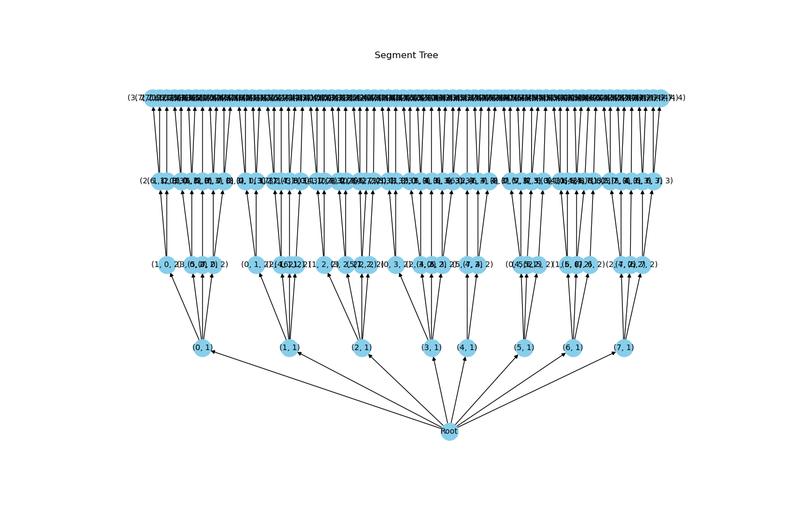

## Implementation

###  Quad Detection

After all possible segments are detected, it's time to find all of the potential and valid quadrilaterals (or quads). All four vectors must be close enough to one another and have the same winding order. To find these segments, the algorithm takes a recursive depth-first search approach.

#### Segmentation Tree
To optimize searching through all combinations of segments, the algorithm constructs a tree with a depth of four. At depth one, all segments are added to the tree as a node. From the next three layers, any segment that hasn't already been picked by its parent nodes and obeys the winding rule and a close enough threshold is added on.

*Example Segment Tree with Eight Segments*

#### Distance Threshold and Lookup Table
The distance between segments is calculated from the end coordinates of the first segment to the starting coordinates of the second segment. According to [Olson's original April Tag Paper](https://april.eecs.umich.edu/media/pdfs/olson2011tags.pdf), an appropriate threshold for segment distance is determined as twice the length of the first segment plus an additional five pixels. While this threshold may result in a relatively high false positive rate, later steps in the algorithm revisit these quads to narrow down the list. The paper emphasizes the importance of maintaining a high false positive rate to ensure that all real April tags are included within the quads.

The segmentation tree building algorithm references the distance between segments and checks if it's under the threshold a large number of times. To optimize the algorithm, the paper suggests performing these calculations only once by creating a lookup table. Our lookup table is of size [n x n], where 'n' represents the total number of segments. Each value in the table is either 'true' or 'false' and signifies whether the first segment is considered "close enough" to the second segment

#### Winding Order Lookup Table
For a quad to be valid, all of its segments must follow a specific winding order. Each segment has a starting point and an end point, which means they all have a direction. Winding order checks that each segment goes in the same direction. Determining the winding direction involves taking the cross product of two segments. A positive value indicates a clockwise winding order, while a negative value indicates a counterclockwise order.

While the paper didn't specify the method used to check winding order when building the tree, we decided to reuse the lookup table technique employed for the distance threshold. This lookup table contained the sign of the cross product for each segment, represented as -1, 0, or 1. We converted the cross product into its sign to simplify the value checking in our tree-building function. The tree-building function checked if the current depth matched the winding order of the previous depth. Therefore, the lookup table would contain either 1 or -1 for each complete branch of the tree. Note that the value cannot be 0, as it would indicate that two connecting segments are parallel to each other.

#### Depth First Search
Once the tree was completed, a depth-first search recursively explored the tree to find any path containing exactly four segments/nodes. While most of the optimization and removal of invalid quads happens during tree construction, we still need to ensure that we avoid counting quads twice. The tree may contain quads with the same segments in different orders. To address this issue, we only allowed quads that start with the segment having the minimum index out of the other segments in the quad to be added to the list of quads.

